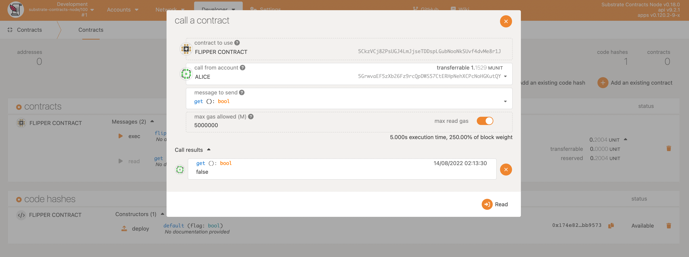
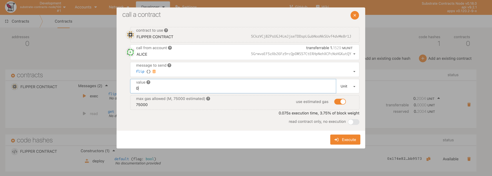
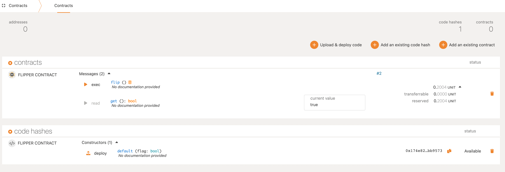

Now that your contract has been fully deployed, we can start interacting with it!
Flipper only has two functions, `flip()` and `get()` so we will show you what it's like to play with both of them.

## 1. get() function

We set the initial value of the Flipper contract `value` to `false` when we instantiated the contract.
Let's check that this is the case.

In the **Messages** section, select the **exec** button and select the **"get(): bool"** message and accept the default values for the other options.

Press **Read** button and confirm that it returns the value `false`:

## 2. flip() function

So let's make the value turn `true` now!

The alternative message to send with the UI is `flip()`.
Again, select the **exec** button and select the **"flip()"** message and accept the default values for the other options.

Press **Execute** button, and then sign and submit the transactoin.

If the transaction was successful, we should then be able to go back to the `get()` function and see our updated storage:

