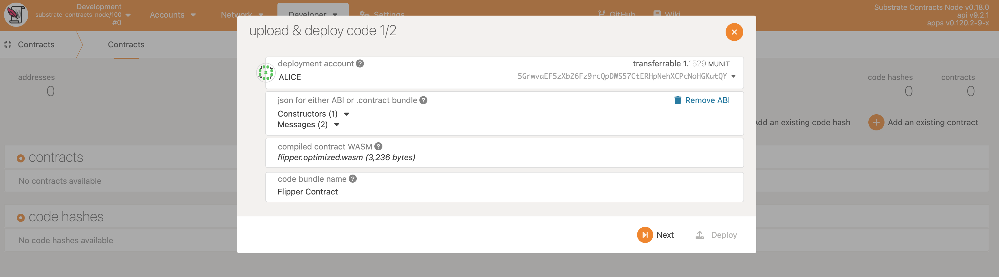
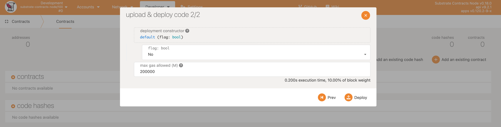
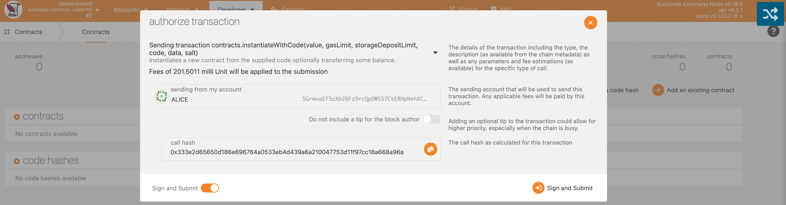
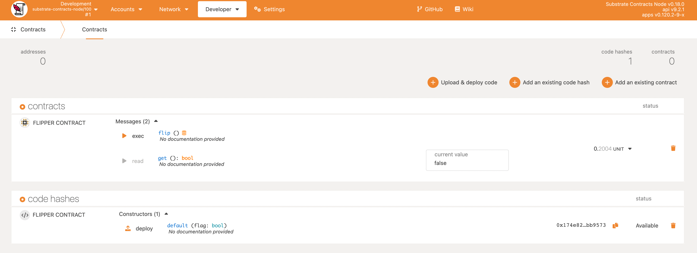

Now that we have generated the Wasm binary from our source code and connected to a local node, we want to deploy this contract onto our Substrate blockchain.

Smart contract deployment on Substrate is a little different than on traditional smart contract blockchains.

Whereas a completely new blob of smart contract source code is deployed each time you push a contract on other platforms, Substrate opts to optimize this behavior. For example, the standard ERC20 token has been deployed to Ethereum thousands of times, sometimes only with changes to the initial configuration (through the Solidity `constructor` function). Each of these instances take up space on the blockchain equivalent to the contract source code size, even though no code was actually changed.

In Substrate, the contract deployment process is split into two steps:

1. Putting your contract code on the blockchain
2. Creating an instance of your contract

With this pattern, contract code like the ERC20 standard can be put on the blockchain one single time, but instantiated any number of times. No need to continually upload the same source code over and waste space on the blockchain.

## 1. Upload Contract Code

Here we will upload the contract code and instantiate one copy of the contract on the blockchain (which is usually why we upload the contract code in the first place):

- Click the **Upload & deploy code** button in the Contract page.
- Choose an **Instantiation account** (e.g. ALICE).
- Drag the metadata file into the ABI area.
- Drag the flipper wasm blob into the wasm area.
- Give the contract a descriptive Name (e.g. Flipper Contract, default is the name of wasm blob file).
- Click the Next button.

## 2. Instantiate a Contract on the Blockchain

Smart contracts exist as an extension of the account system on the blockchain.
Thus creating an instance of this contract will create a new `AccountId` which will store any balance
managed by the smart contract and allow us to interact with the contract.

Now a screen displays the information that represents our smart contract. We are going to instantiate a copy of the smart contract:

- Accept the default options for the contract **Deployment Con
structor**.
- Accept the default options **Max Gas Allowed** of `200000`.
- Click on `Next` button.

The transaction is now queued, click **Sign and Submit** button to send the transaction.

Now you can interact with the newly created contract instance.

