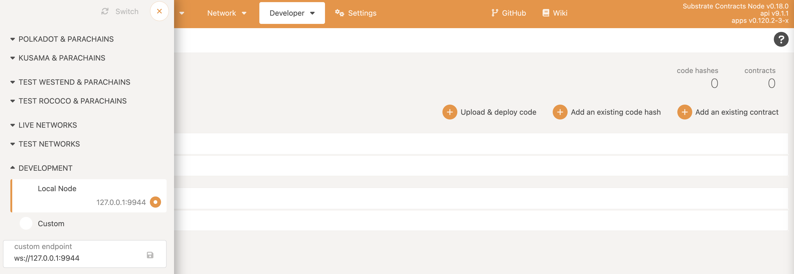

`Ask!` contracts can be deployed to any substrate-based blockchain that supports the `pallet-contracts`.

## substrate-contracts-node

The [substrate-contracts-node](https://github.com/paritytech/substrate-contracts-node) is a simple Substrate blockchain which is configured to include the contracts module.

It's a comfortable option if you want to get a quickstart.

After successfully installing `substrate-contracts-node`, you can start a local development chain by running:

```bash
cd substrate-contracts-node

cargo build --release

./target/release/subtrate-contracts-node --dev -d dev
```

You should start to see blocks being produced by your node in your terminal once you start to send transactoins.

```log
2022-08-11 15:17:40 Substrate Contracts Node
2022-08-11 15:17:40 ✌️  version 0.18.0-10f07a81efa
2022-08-11 15:17:40 ❤️  by Parity Technologies <admin@parity.io>, 2021-2022
2022-08-11 15:17:40 📋 Chain specification: Development
2022-08-11 15:17:40 🏷  Node name: hard-to-find-sisters-2005
2022-08-11 15:17:40 👤 Role: AUTHORITY
2022-08-11 15:17:40 💾 Database: RocksDb at dev/chains/dev/db/full
2022-08-11 15:17:40 ⛓  Native runtime: substrate-contracts-node-100 (substrate-contracts-node-1.tx1.au1)
2022-08-11 15:17:40 🏷  Local node identity is: 12D3KooWSR1Pi8tahGyLAG4FtPurWnMi6Wb5iABzq9ts3RjNMyHW
2022-08-11 15:17:40 💻 Operating system: macos
2022-08-11 15:17:40 💻 CPU architecture: aarch64
2022-08-11 15:17:40 📦 Highest known block at #0
2022-08-11 15:17:40 Running JSON-RPC HTTP server: addr=127.0.0.1:9933, allowed origins=None
2022-08-11 15:17:40 〽️ Prometheus exporter started at 127.0.0.1:9615
2022-08-11 15:17:40 Running JSON-RPC WS server: addr=127.0.0.1:9944, allowed origins=None
2022-08-11 15:17:45 💤 Idle (0 peers), best: #0 (0x5046…2196), finalized #0 (0x5046…2196), ⬇ 0 ⬆ 0
2022-08-11 15:17:50 💤 Idle (0 peers), best: #0 (0x5046…2196), finalized #0 (0x5046…2196), ⬇ 0 ⬆ 0
2022-08-11 15:17:55 💤 Idle (0 peers), best: #0 (0x5046…2196), finalized #0 (0x5046…2196), ⬇ 0 ⬆ 0
2022-08-11 15:18:00 💤 Idle (0 peers), best: #0 (0x5046…2196), finalized #0 (0x5046…2196), ⬇ 0 ⬆ 0
2022-08-11 15:18:05 💤 Idle (0 peers), best: #0 (0x5046…2196), finalized #0 (0x5046…2196), ⬇ 0 ⬆ 0
2022-08-11 15:18:09 Accepting new connection 1/100
2022-08-11 15:18:10 💤 Idle (0 peers), best: #0 (0x5046…2196), finalized #0 (0x5046…2196), ⬇ 0 ⬆ 0
2022-08-11 15:18:15 💤 Idle (0 peers), best: #0 (0x5046…2196), finalized #0 (0x5046…2196), ⬇ 0 ⬆ 0
2022-08-11 15:18:18 🙌 Starting consensus session on top of parent 0x5046ca84ea46d1f7c23426d304da82422fa7e547974afc0eed72ca5ecc932196
2022-08-11 15:18:18 🎁 Prepared block for proposing at 1 (5 ms) [hash: 0x8bb2e36cec33f77b865ee9f2a1fd7169091afc7348e688b2043bb5bceafaf7ac; parent_hash: 0x5046…2196; extrinsics (2): [0xf64c…041c, 0x568f…5416]]
2022-08-11 15:18:18 Instant Seal success: CreatedBlock { hash: 0x8bb2e36cec33f77b865ee9f2a1fd7169091afc7348e688b2043bb5bceafaf7ac, aux: ImportedAux { header_only: false, clear_justification_requests: false, needs_justification: false, bad_justification: false, is_new_best: true } }
2022-08-11 15:18:18 ✨ Imported #1 (0x8bb2…f7ac)
2022-08-11 15:18:20 💤 Idle (0 peers), best: #1 (0x8bb2…f7ac), finalized #0 (0x5046…2196), ⬇ 0 ⬆ 0
...
```

You can interact with your node using the [Polkadot Apps](https://polkadot.js.org/apps).

Now configure the UI to connect to the locally running node:

- Click on the dropdown selector at top left corner.
- Choose the Local Node.



## Europa

[Europa](https://github.com/patractlabs/europa) is a sandbox to run and debug smart contracts for pallet-contracts module.

TODO
